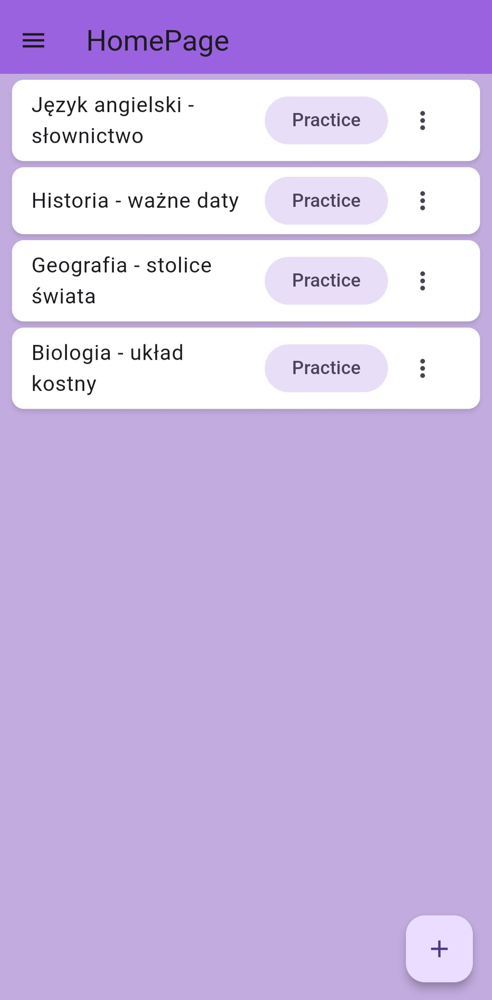

# Memo Deck
Memo Deck to aplikacja do efektywnej nauki fiszek z powtórzeniami. Wykorzystuje SuperMemo do oceny stopnia opanowania karty przez użytkownika i planowania kolejnych powtórek. Dzięki synchronizacji aplikacji z firebase umożliwia pracę na wielu urządzeniach o dostęp do własnych kart dla każdego użytkownika.

## Demo

  
  
  
  

## 🛠 Technologie 
- Firebase – autoryzacja i storage, umożliwiające pracę na wielu urządzeniach i przechowywanie kart urzytkownika.
- Algorytm SuperMemo – ocena opanowania kart i wyznaczanie optymalnych interwałów powtórek.

## 🎯 Funkcjonalności
- Tworzenie i zarządzanie taliami fiszek.
- Przeglądanie kart oraz śledzenie statystyk nauki.
- Tryb nauki oparty na algorytmie SuperMemo.
- Synchronizacja postępów między urządzeniami dzięki Firebase.
- Przeglądanie kolekcji fiszek wraz z filtrowaniem, dzięki metodzie paginacji jest realizowane w efektywny sposób.
