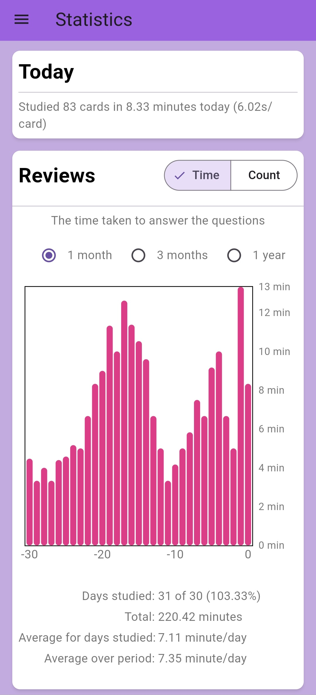

# Memo Deck
Memo Deck to aplikacja do efektywnej nauki fiszek z powtórzeniami. Wykorzystuje SuperMemo do oceny stopnia opanowania karty przez użytkownika i planowania kolejnych powtórek. Dzięki synchronizacji aplikacji z firebase umożliwia pracę na wielu urządzeniach o dostęp do własnych kart dla każdego użytkownika.

## Demo

  
  
  

## 🎯 Funkcjonalności
- Tworzenie i zarządzanie taliami fiszek.
- Przeglądanie kart oraz śledzenie statystyk nauki.
- Tryb nauki oparty na algorytmie SuperMemo.
- Synchronizacja postępów między urządzeniami dzięki Firebase.
- Przeglądanie kolekcji fiszek wraz z filtrowaniem, dzięki metodzie paginacji jest realizowane w efektywny sposób.

## 🛠 Technologie

W tym projekcie wykorzystano następujące technologie:

- **Firebase** – użyte do autoryzacji użytkowników oraz przechowywania danych (storage). Firebase umożliwia synchronizację danych między różnymi urządzeniami oraz przechowywanie kart użytkownika w chmurze.
  - [Firebase](https://firebase.google.com/)

- **flutter_bloc** – biblioteka do zarządzania stanem aplikacji z użyciem wzorca BLoC (Business Logic Component). Pozwala na lepszą organizację kodu i oddzielenie logiki od interfejsu użytkownika.
  - [Bloc](https://pub.dev/packages/flutter_bloc)
- **fl_chart** – biblioteka do rysowania wykresów i diagramów w aplikacjach Flutter. Dzięki niej możliwe jest łatwe tworzenie dynamicznych wykresów.
  - [fl_chart](https://pub.dev/packages/fl_chart)
- **go_router** – biblioteka do nawigacji w aplikacjach Flutter, która umożliwia łatwe i bezpieczne zarządzanie routami. Dzięki go_router można tworzyć rozbudowane ścieżki nawigacyjne oraz obsługiwać dynamiczne parametry w URL.
  - [go_router](https://pub.dev/packages/go_router)
- **Algorytm SuperMemo** – implementacja algorytmu służącego do oceny opanowania kart oraz wyznaczania optymalnych interwałów powtórek. Algorytm ten jest używany do efektywnego nauczania i zapamiętywania informacji w systemie opartym na powtórkach z czasem.
  - [SuperMemo](https://en.wikipedia.org/wiki/SuperMemo)

